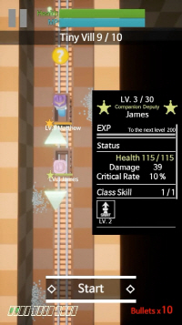

- 출시일: 2020년 3월
- 플랫폼: iOS, Android
- 장르: 슈팅, 퍼즐
- 언어: 한국어, 영어

# 다운로드

# 게임 소개

- 보안관이 되어 좀비들을 처치하고 생존자들을 구출하세요!
- 광산수레를 타고 광산을 탐험하세요!
- 한 발의 탄환으로 선로를 바꾸고 좀비들을 처치하세요!
- 구출한 생존자를 동료로 삼거나 마을로 돌려보내세요!
- 벽, 오일 램프, 폭발물 등 살아남는데 도움이 된다면 모든 것을 이용하세요!

# 스크린샷

# FAQ

- Q> 세이브 파일은 어디에 저장되나요?
- A> 세이브 파일은 두 개이며 "Autosave_session_v1.sav" 와 "Autosave_system_v1.sav" 입니다.
iOS에서는 아이튠즈에서 레일로드 히어로 앱의 도큐멘트 "CG_Ship/Saved/SaveGames" 폴더에 저장됩니다.
안드로이드에서는 "UE4Game/CG_Ship/Saved/SaveGames" 폴더에 저장됩니다.

- Q> 업데이트 후 업적이 초기화됐어요! 어떻게 복구하죠?
- A> 업데이트 후 세이브 파일 경로가 변경되었을 수 있습니다. 업데이트 전의 세이브 파일 경로에서 세이브 파일 두 개("Autosave_session_v1.sav" 와 "Autosave_system_v1.sav")를 복사하여 올바른 경로에 붙여넣어주세요. 불편을 드려 죄송합니다...

# 참가 행사

