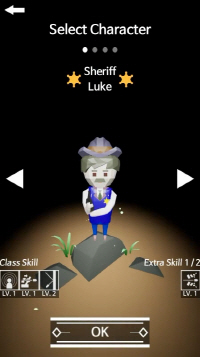
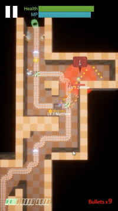
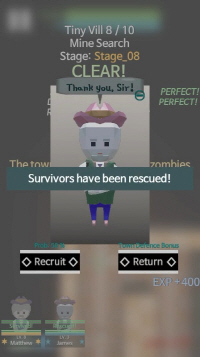
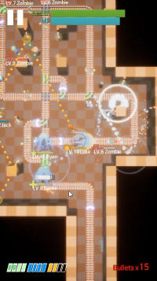
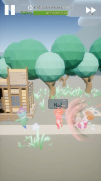

- RELEASE DATE: March 2020
- PLATFORM: iOS, Android
- GENRE: Shooter, Puzzle
- LANGUAGES: Korean, English

# DOWNLOAD

# ABOUT THIS GAME

- Become a sheriff, kill zombies and rescue survivors.
- Explore the mines in a mining cart.
- Switch tracks and kill zombies with one shot.
- Rescue survivors as companions or send them back to town.

# SCREENSHOTS

# FAQ

- Q> Where are save files stored?
- A> The save files are named "Autosave_session_v1.sav" and "Autosave_system_v1.sav"
On iOS, it's saved under "CG_Ship/Saved/SaveGames" in the document you can see on iTunes.
On Android, it is saved under "UE4Game/CG_Ship/Saved/SaveGames"

- Q> After updating, the achievement has been reset!
- A> The save path for save files may have changed after updating. 
Find the old save files in the storage ("Autosave_system_v1.sav" and "Autosave_session_v1.sav") and move them to the correct path(/CG_Ship/Saved/SaveGames). 
Sorry for the inconvenience.
