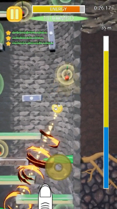

- 출시일: 2020년 9월
- 플랫폼: iOS, Android
- 장르: 캐주얼, 벽돌깨기, 핀볼
- 언어: 한국어, 영어

# 타이니 라이징 다운로드 (무료 버전)

# 타이니 라이징 VIP 다운로드 (유료 버전)

# 게임 소개

- 오염된 물이 차오르기 전에 서둘러 우물을 빠져나가세요!
- 다음에 발을 디딜 위치를 찾아 정확한 타이밍에 점프하세요!
- 약한 장애물을 파괴하며 솟아오르는 강력한 슈퍼 점프를 시도하세요!
- 다양한 장애물을 피하고, 열매를 먹어 에너지를 회복하며 계속 올라가세요!

# 스크린샷

# FAQ

- Q> 무료 버전(타이니 라이징)과 유료 버전(타이니 라이징 VIP)의 차이가 뭔가요?
  - A> 유료 버전에서는 광고가 덜 나옵니다.
    - 무료 버전에서는 가끔 스테이지를 시작하기 전에 전면 광고가 나옵니다.
    - 유료 버전에서는 전면 광고가 나오지 않습니다.
    - 보상형 광고는 무료 버전과 유료 버전에서 모두 나옵니다.
- Q> 세이브 파일은 어디에 저장되나요?
  - A> 세이브 파일의 이름은 "autosave_v1.sav" 입니다.
    - iOS (타이니 라이징): 아이튠즈 타이니 라이징 앱의 도큐멘트 "TR_Dev/Saved/SaveGames" 폴더에 저장됩니다.
    - 안드로이드 (타이니 라이징): "UE4Game/TR_Dev/TR_Dev/Saved/SaveGames" 폴더에 저장됩니다.
    - 안드로이드 (타이니 라이징 VIP): "UE4Game/TRP_Dev/TRP_Dev/Saved/SaveGames" 폴더에 저장됩니다.
- Q> 무료 버전(타이니 라이징)을 플레이하다가 유료 버전(타이니 라이징 VIP)을 구매했는데 세이브 파일 연동이 안돼요!
  - A> 세이브 파일을 자동으로 연동하는 기능은 지원하지 않습니다. 죄송합니다.
    - 수동으로 세이브 파일을 복사하여 붙여넣으면 다른 버전에서 플레이하던 시점부터 이어할 수 있습니다.
- Q> 업데이트 후 업적이 초기화됐어요! 어떻게 복구하죠?
  - A> 업데이트 후 세이브 파일 경로가 변경되었을 수 있습니다. 업데이트 전의 세이브 파일 경로에서 세이브 파일("autosave_v1.sav")을 복사하여 올바른 경로에 붙여넣어주세요. 불편을 드려 죄송합니다...
