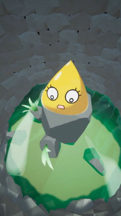
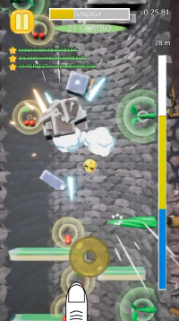
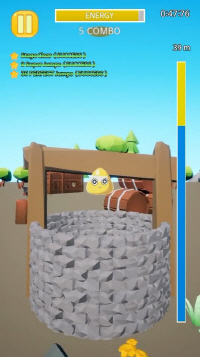
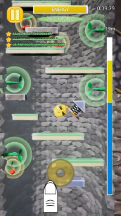
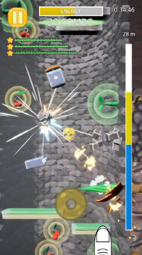
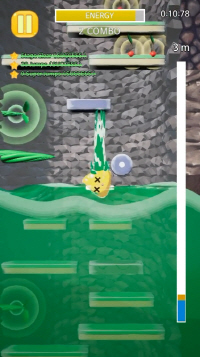

- RELEASE DATE: September 2020
- PLATFORM: iOS, Android
- GENRE: Casual, Breakout, Pinball
- LANGUAGES: Korean, English

# DOWNLOAD

## Tiny Rising (Free Version)

## Tiny Rising VIP (Paid Version)

# ABOUT THIS GAME

- Hurry to escape from the well before polluted water fills up!
- Find where to step next and jump at the right timing!
- Try powerful super jumps that rise through weak obstacles!
- Avoid various obstacles, eat fruit to recover energy and keep climbing!

# SCREENSHOTS

# FAQ

- Q> What is the difference between the free version (Tiny Rising) and the paid version (Tiny Rising VIP)?
   - A> There are less ads in the paid version.
     - In the free version, interstitial ads sometimes appear before the stage starts.
     - Interstitial ads do not appear in the paid version.
     - Rewarded ads appear in both free and paid versions.
- Q> Where is save file stored?
  - A> The save file is named "autosave_v1.sav"
    - iOS (Tiny Rising, Free Version): It's saved under "TR_Dev/Saved/SaveGames" in the document you can see on iTunes.
    - Android (Tiny Rising, Free Version): It's saved under "UE4Game/TR_Dev/TR_Dev/Saved/SaveGames"
    - Android (Tiny Rising VIP, Paid Version): It's saved under "UE4Game/TRP_Dev/TRP_Dev/Saved/SaveGames"
-Q> While playing the free version (Tiny Rising), I purchased the paid version (Tiny Rising VIP), but the save files cannot be linked!
   -A> The function to automatically link save files is not supported. Sorry.
     - By manually copying and pasting the save file, you can continue from the point you were playing in another version.
- Q> After updating, the achievement has been reset!
  - A> The save path for save file may have changed after updating. 
    - Find the old save file in the storage ("autosave_v1.sav") and move it to the correct path.
    - Sorry for the inconvenience.
